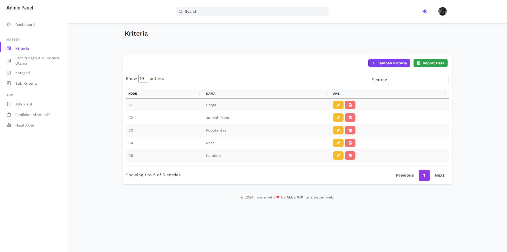
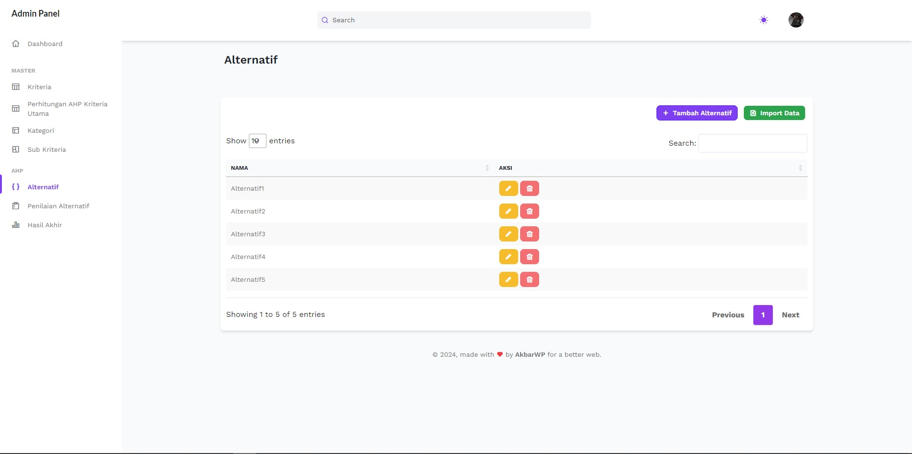
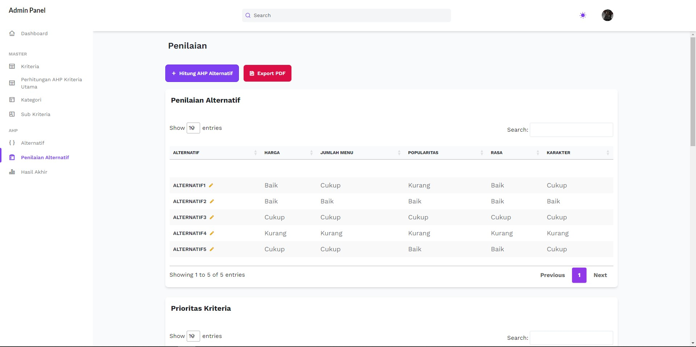
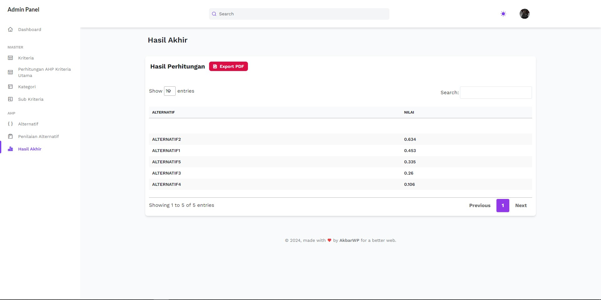

<p align="center"></p>

# Configurasi

### Instalasi Kebutuhan Awal
Install composer dan npm
```
$ composer update
```
```
$ npm install
```
Generate Key
```
$ php artisan generate:key
```
Migrasi Database
```
$ php artisan migrate --seed
```
Terakhir
```
$ npm run dev
```
```
$ php artisan serve
```

# Documentation
<p align="center"></p>
<p align="center"></p>
<p align="center"></p>
<p align="center"></p>
<p align="center"></p>
<p align="center"></p>
<p align="center"></p>
<p align="center"></p>
<p align="center"></p>
